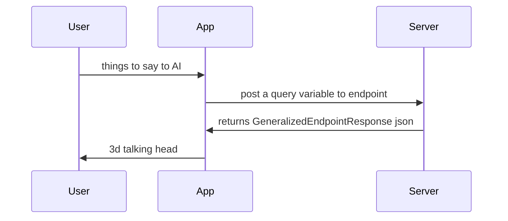

character3d is a framework that lets you have a 3D talking head chat as the interface for your AI endpoint.

as long as your endpoint returns the response below, the 3d talking head will be able to process it 

The user sends data posted a form variable called `query` and the app expects a response in this format: 

```
public class GeneralizedEndpointResponse
{
    public string query; // nice to have (the original query the user sent) 
    public string txtresponse; // required 
    public string urlpolly; // url to a MP3 file - optional, by default AWS Polly will be used to text to speech
}
```
json version of it (replace values with your own, not the commented dummy text)
``` 
{
    "query": " // nice to have (the original query the user sent)  ",
    "txtresponse": "// required ",
    "urlpolly: " // url to a MP3 file - optional, by default AWS Polly will be used to text to speech"
}
```



